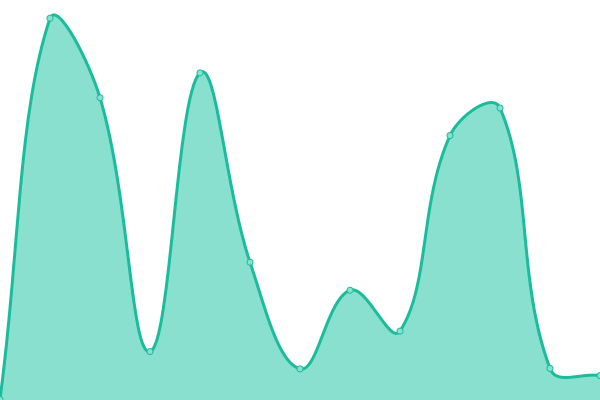

# [📈 Live Status](https://appellet.github.io): <!--live status--> **🟧 Partial outage**

This repository contains the open-source uptime monitor and status page for [Upptime](https://upptime.js.org), powered by [Upptime](https://github.com/upptime/upptime).

With [Upptime](https://upptime.js.org), you can get your own unlimited and free uptime monitor and status page, powered entirely by a GitHub repository. We use [Issues](https://github.com/upptime/upptime/issues) as incident reports, [Actions](https://github.com/upptime/upptime/actions) as uptime monitors, and [Pages](https://appellet.github.io) for the status page.

<!--start: status pages-->
<!-- This summary is generated by Upptime (https://github.com/upptime/upptime) -->
<!-- Do not edit this manually, your changes will be overwritten -->
<!-- prettier-ignore -->
| URL | Status | History | Response Time | Uptime |
| --- | ------ | ------- | ------------- | ------ |
|  [Git](http://45.147.97.90:3000) | 🟩 Up | [git.yml](https://github.com/appellet/upptime/commits/HEAD/history/git.yml) | 

 777ms
     
 | 

<a href="https://appellet.github.io/history/git">100.00%</a>
    

|  [Plex](http://45.147.97.90:32400) | 🟥 Down | [plex.yml](https://github.com/appellet/upptime/commits/HEAD/history/plex.yml) | 

 208ms
     
 | 

<a href="https://appellet.github.io/history/plex">100.00%</a>
    

|  [Sonar](http://45.147.97.90:8989) | 🟩 Up | [sonar.yml](https://github.com/appellet/upptime/commits/HEAD/history/sonar.yml) | 

 1521ms
     
 | 

<a href="https://appellet.github.io/history/sonar">100.00%</a>
    

|  [Radarr](http://45.147.97.90:7878) | 🟩 Up | [radarr.yml](https://github.com/appellet/upptime/commits/HEAD/history/radarr.yml) | 

 379ms
     
 | 

<a href="https://appellet.github.io/history/radarr">100.00%</a>
    

|  [Jackett](http://45.147.97.90:9117) | 🟥 Down | [jackett.yml](https://github.com/appellet/upptime/commits/HEAD/history/jackett.yml) | 

 828ms
     
 | 

<a href="https://appellet.github.io/history/jackett">100.00%</a>
    

|  [QBTorrent](http://45.147.97.90:8090) | 🟥 Down | [qb-torrent.yml](https://github.com/appellet/upptime/commits/HEAD/history/qb-torrent.yml) | 

 222ms
     
 | 

<a href="https://appellet.github.io/history/qb-torrent">100.00%</a>
    

|  [Netdata](http://45.147.97.90:19999) | 🟥 Down | [netdata.yml](https://github.com/appellet/upptime/commits/HEAD/history/netdata.yml) | 

 311ms
     
 | 

<a href="https://appellet.github.io/history/netdata">100.00%</a>
    

|  [Minecraft](45.147.97.90) | 🟥 Down | [minecraft.yml](https://github.com/appellet/upptime/commits/HEAD/history/minecraft.yml) | 

 136ms
     
 | 

<a href="https://appellet.github.io/history/minecraft">100.00%</a>
    

|  [Minecraft Cousins](45.147.97.90) | 🟩 Up | [minecraft-cousins.yml](https://github.com/appellet/upptime/commits/HEAD/history/minecraft-cousins.yml) | 

 127ms
     
 | 

<a href="https://appellet.github.io/history/minecraft-cousins">100.00%</a>
    

<!--end: status pages-->

[**Visit our status website →**](https://appellet.github.io)

## 📄 License

- Powered by: [Upptime](https://github.com/upptime/upptime)
- Code: [MIT](./LICENSE) © [Anand Chowdhary](https://anandchowdhary.com), supported by [Pabio](https://pabio.com)
- Data in the `./history` directory: [Open Database License](https://opendatacommons.org/licenses/odbl/1-0/)
