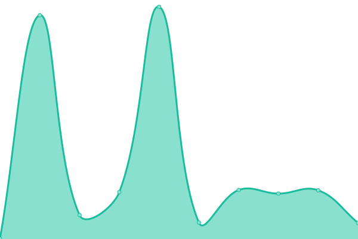
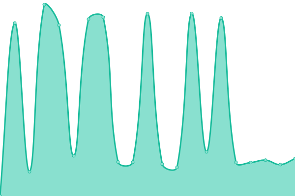

# [📈 Live Status](https://appellet.github.io): <!--live status--> **🟧 Partial outage**

This repository contains the open-source uptime monitor and status page for [Upptime](https://upptime.js.org), powered by [Upptime](https://github.com/upptime/upptime).

With [Upptime](https://upptime.js.org), you can get your own unlimited and free uptime monitor and status page, powered entirely by a GitHub repository. We use [Issues](https://github.com/upptime/upptime/issues) as incident reports, [Actions](https://github.com/appellet/upptime/actions) as uptime monitors, and [Pages](https://status.tibiscuit.ch) for the status page.

<!--start: status pages-->
<!-- This summary is generated by Upptime (https://github.com/upptime/upptime) -->
<!-- Do not edit this manually, your changes will be overwritten -->
<!-- prettier-ignore -->
| URL | Status | History | Response Time | Uptime |
| --- | ------ | ------- | ------------- | ------ |
|  [Git](https://git.tibiscuit.ch/) | 🟥 Down | [git.yml](https://github.com/appellet/upptime/commits/HEAD/history/git.yml) | 

 844ms
     
 | 

<a href="https://status.tibiscuit.ch/history/git">79.89%</a>
    

|  [Plex](https://plex.tibiscuit.ch/web/index.html) | 🟩 Up | [plex.yml](https://github.com/appellet/upptime/commits/HEAD/history/plex.yml) | 

 808ms
     
 | 

<a href="https://status.tibiscuit.ch/history/plex">99.09%</a>
    

|  [TimeTagger](https://tagger.tibiscuit.ch/) | 🟥 Down | [time-tagger.yml](https://github.com/appellet/upptime/commits/HEAD/history/time-tagger.yml) | 

 912ms
     
 | 

<a href="https://status.tibiscuit.ch/history/time-tagger">98.90%</a>
    

|  [QBTorrent](https://qbt.tibiscuit.ch/) | 🟥 Down | [qb-torrent.yml](https://github.com/appellet/upptime/commits/HEAD/history/qb-torrent.yml) | 

 780ms
     
 | 

<a href="https://status.tibiscuit.ch/history/qb-torrent">79.33%</a>
    

|  [Netdata](https://netdata.tibiscuit.ch) | 🟥 Down | [netdata.yml](https://github.com/appellet/upptime/commits/HEAD/history/netdata.yml) | 

 679ms
     
 | 

<a href="https://status.tibiscuit.ch/history/netdata">79.33%</a>
    

|  [OwnCloud](https://cloud.tibiscuit.ch) | 🟩 Up | [own-cloud.yml](https://github.com/appellet/upptime/commits/HEAD/history/own-cloud.yml) | 

 687ms
     
 | 

<a href="https://status.tibiscuit.ch/history/own-cloud">99.09%</a>
    

|  [Immich](https://img.tibiscuit.ch) | 🟥 Down | [immich.yml](https://github.com/appellet/upptime/commits/HEAD/history/immich.yml) | 

 2538ms
     
 | 

<a href="https://status.tibiscuit.ch/history/immich">13.18%</a>
    

|  [Minecraft Cousins](cousins.tibiscuit.ch) | 🟥 Down | [minecraft-cousins.yml](https://github.com/appellet/upptime/commits/HEAD/history/minecraft-cousins.yml) | 

 0ms
     
 | 

<a href="https://status.tibiscuit.ch/history/minecraft-cousins">0.00%</a>
    

|  [Minecraft Raspberry](mc.tibiscuit.ch) | 🟥 Down | [minecraft-raspberry.yml](https://github.com/appellet/upptime/commits/HEAD/history/minecraft-raspberry.yml) | 

 100ms
     
 | 

<a href="https://status.tibiscuit.ch/history/minecraft-raspberry">75.83%</a>
    

|  [Raspberry Pi5](45.147.97.90) | 🟩 Up | [raspberry-pi5.yml](https://github.com/appellet/upptime/commits/HEAD/history/raspberry-pi5.yml) | 

 110ms
     
 | 

<a href="https://status.tibiscuit.ch/history/raspberry-pi5">96.50%</a>
    

<!--end: status pages-->

[**Visit our status website →**](https://status.tibiscuit.ch))

## 📄 License

- Powered by: [Upptime](https://github.com/upptime/upptime)
- Code: [MIT](./LICENSE) © [Anand Chowdhary](https://anandchowdhary.com), supported by [Pabio](https://pabio.com)
- Data in the `./history` directory: [Open Database License](https://opendatacommons.org/licenses/odbl/1-0/)
