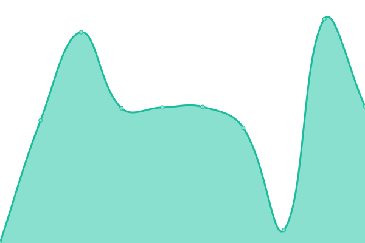

# [📈 Live Status](https://appellet.github.io): <!--live status--> **🟧 Partial outage**

This repository contains the open-source uptime monitor and status page for [Upptime](https://upptime.js.org), powered by [Upptime](https://github.com/upptime/upptime).

With [Upptime](https://upptime.js.org), you can get your own unlimited and free uptime monitor and status page, powered entirely by a GitHub repository. We use [Issues](https://github.com/upptime/upptime/issues) as incident reports, [Actions](https://github.com/appellet/upptime/actions) as uptime monitors, and [Pages](https://status.tibiscuit.ch) for the status page.

<!--start: status pages-->
<!-- This summary is generated by Upptime (https://github.com/upptime/upptime) -->
<!-- Do not edit this manually, your changes will be overwritten -->
<!-- prettier-ignore -->
| URL | Status | History | Response Time | Uptime |
| --- | ------ | ------- | ------------- | ------ |
|  [Server](45.155.170.218) | 🟥 Down | [server.yml](https://github.com/appellet/upptime/commits/HEAD/history/server.yml) | 

 0ms
     
 | 

<a href="https://status.tibiscuit.ch/history/server">0.00%</a>
    

|  [Raspberry Pi5](45.155.170.218) | 🟩 Up | [raspberry-pi5.yml](https://github.com/appellet/upptime/commits/HEAD/history/raspberry-pi5.yml) | 

 113ms
     
 | 

<a href="https://status.tibiscuit.ch/history/raspberry-pi5">100.00%</a>
    

|  [NAS](https://nas.tibiscuit.ch) | 🟥 Down | [nas.yml](https://github.com/appellet/upptime/commits/HEAD/history/nas.yml) | 

 188ms
     
 | 

<a href="https://status.tibiscuit.ch/history/nas">0.00%</a>
    

|  [Git](https://git.tibiscuit.ch/) | 🟥 Down | [git.yml](https://github.com/appellet/upptime/commits/HEAD/history/git.yml) | 

 507ms
     
 | 

<a href="https://status.tibiscuit.ch/history/git">0.00%</a>
    

|  [Jellyfin](https://jellyfin.tibiscuit.ch/) | 🟥 Down | [jellyfin.yml](https://github.com/appellet/upptime/commits/HEAD/history/jellyfin.yml) | 

 197ms
     
 | 

<a href="https://status.tibiscuit.ch/history/jellyfin">0.00%</a>
    

|  [TimeTagger](https://tagger.tibiscuit.ch/) | 🟥 Down | [time-tagger.yml](https://github.com/appellet/upptime/commits/HEAD/history/time-tagger.yml) | 

 137ms
     
 | 

<a href="https://status.tibiscuit.ch/history/time-tagger">0.00%</a>
    

|  [Sonarr](https://sonarr.tibiscuit.ch) | 🟥 Down | [sonarr.yml](https://github.com/appellet/upptime/commits/HEAD/history/sonarr.yml) | 

 172ms
     
 | 

<a href="https://status.tibiscuit.ch/history/sonarr">0.00%</a>
    

|  [Radarr](https://radarr.tibiscuit.ch) | 🟥 Down | [radarr.yml](https://github.com/appellet/upptime/commits/HEAD/history/radarr.yml) | 

 144ms
     
 | 

<a href="https://status.tibiscuit.ch/history/radarr">0.00%</a>
    

|  [QBTorrent](https://qbt.tibiscuit.ch/) | 🟥 Down | [qb-torrent.yml](https://github.com/appellet/upptime/commits/HEAD/history/qb-torrent.yml) | 

 173ms
     
 | 

<a href="https://status.tibiscuit.ch/history/qb-torrent">0.00%</a>
    

|  [Jellyseerr](https://jellyseerr.tibiscuit.ch/) | 🟥 Down | [jellyseerr.yml](https://github.com/appellet/upptime/commits/HEAD/history/jellyseerr.yml) | 

 174ms
     
 | 

<a href="https://status.tibiscuit.ch/history/jellyseerr">0.00%</a>
    

|  [Joplin](https://joplin.tibiscuit.ch) | 🟥 Down | [joplin.yml](https://github.com/appellet/upptime/commits/HEAD/history/joplin.yml) | 

 132ms
     
 | 

<a href="https://status.tibiscuit.ch/history/joplin">0.00%</a>
    

|  [Vaultwarden](https://vault.tibiscuit.ch) | 🟥 Down | [vaultwarden.yml](https://github.com/appellet/upptime/commits/HEAD/history/vaultwarden.yml) | 

 99ms
     
 | 

<a href="https://status.tibiscuit.ch/history/vaultwarden">0.00%</a>
    

|  [Minecraft Cousins](cousins.tibiscuit.ch) | 🟥 Down | [minecraft-cousins.yml](https://github.com/appellet/upptime/commits/HEAD/history/minecraft-cousins.yml) | 

 0ms
     
 | 

<a href="https://status.tibiscuit.ch/history/minecraft-cousins">0.00%</a>
    

<!--end: status pages-->

[**Visit our status website →**](https://status.tibiscuit.ch))

## 📄 License

- Powered by: [Upptime](https://github.com/upptime/upptime)
- Code: [MIT](./LICENSE) © [Anand Chowdhary](https://anandchowdhary.com), supported by [Pabio](https://pabio.com)
- Data in the `./history` directory: [Open Database License](https://opendatacommons.org/licenses/odbl/1-0/)
